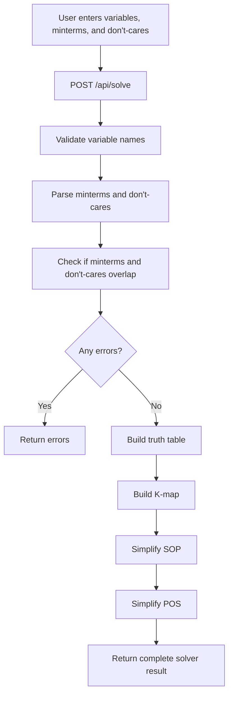
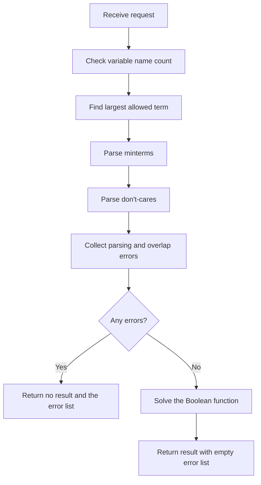
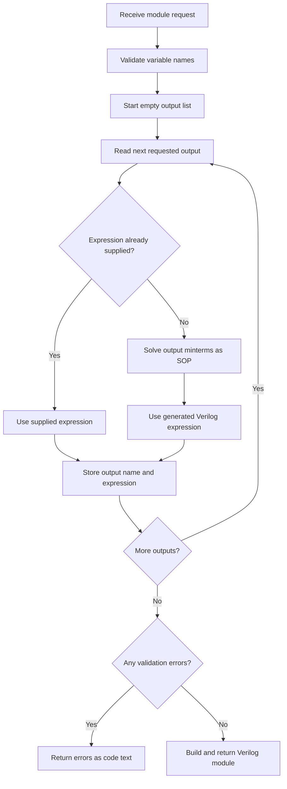
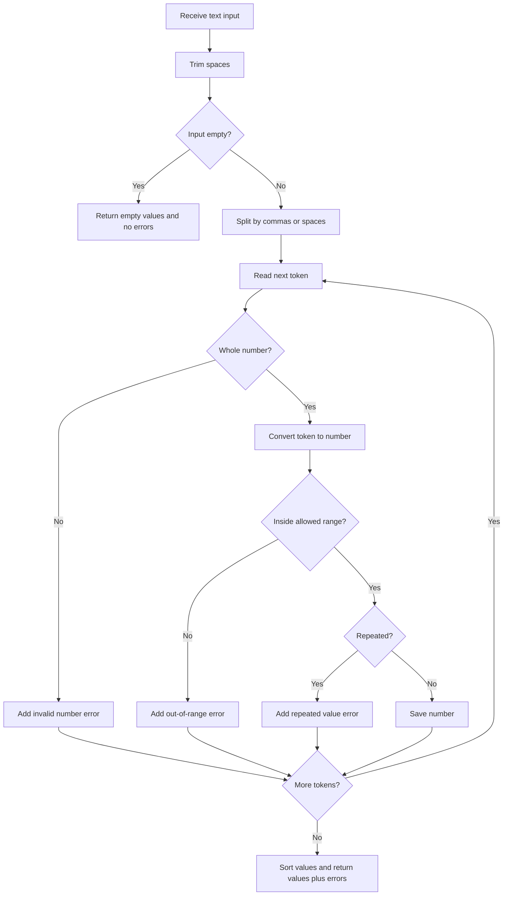
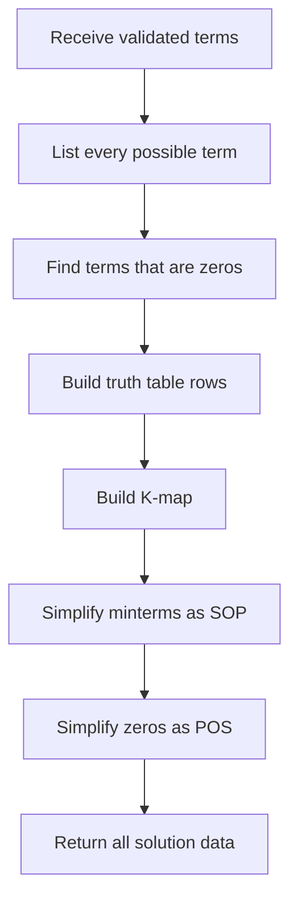
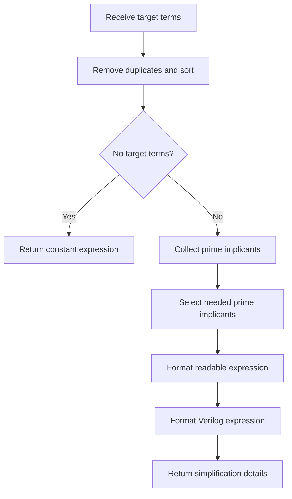
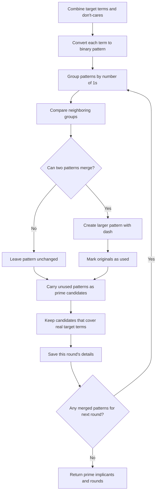
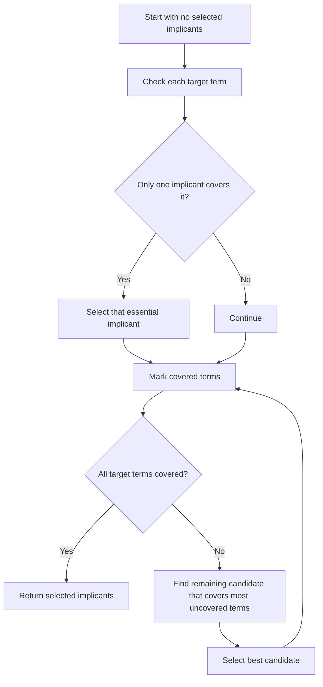
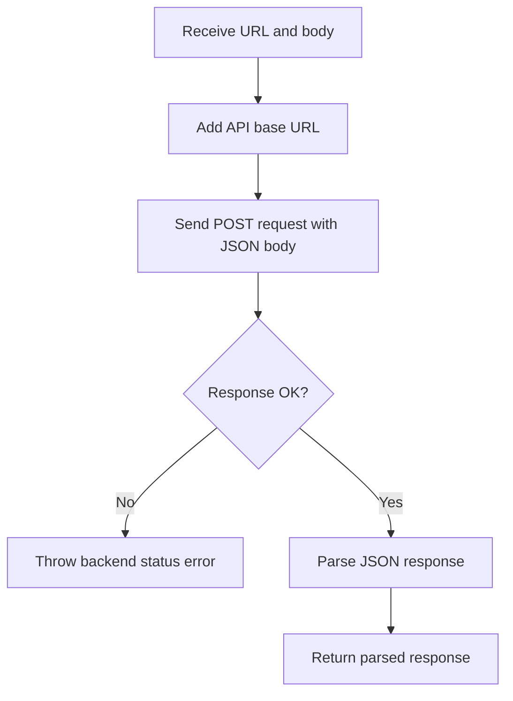

# Flowcharts and Layman's Algorithms

This document covers the program's non-GUI logic functions. React components,
UI wrappers, styling helpers, and display-only functions are intentionally
excluded because they mainly render the screen instead of solving the Boolean
problem.

## Main Solver Flow

## Backend API Functions

### `solve(request)`

Purpose: receives the user's solver input and returns either errors or the
complete Boolean solution.

Layman's algorithm:

1. Check if the number of variable names matches the selected variable count.
2. Compute the highest valid term number.
3. Convert the minterm text into a clean number list.
4. Convert the don't-care text into a clean number list.
5. Check whether any number appears in both lists.
6. If there are errors, send those errors back.
7. If there are no errors, solve the Boolean function and send back the result.

### `verilog_module(request)`

Purpose: creates a complete Verilog module from one or more output definitions.

Layman's algorithm:

1. Check if the variable names are valid.
2. Go through every requested output.
3. If an output already has a Verilog expression, use it.
4. If not, solve that output's minterms and use its simplified SOP Verilog.
5. Save each output name and expression.
6. If validation failed, return the error text.
7. Otherwise, format everything as one Verilog module.

### `validate_variable_names(variable_count, variable_names)`

Purpose: makes sure the request has exactly one name per variable.

Layman's algorithm:

1. Count the variable names sent by the frontend.
2. Compare that count with the selected variable count.
3. If they match, return no errors.
4. If they do not match, return one clear error message.

## Backend Solver Functions

### `get_default_variable_names(count)`

Purpose: gives the first few standard variable names.

Layman's algorithm:

1. Start from `A, B, C, D`.
2. Return only as many names as needed.

### `get_max_term(variable_count)`

Purpose: finds the biggest valid minterm number for the variable count.

Layman's algorithm:

1. Compute `2` raised to the number of variables.
2. Subtract `1` because counting starts at `0`.
3. Return that number.

### `parse_term_list(input_text, label, max_term)`

Purpose: turns comma- or space-separated input text into validated term numbers.

Layman's algorithm:

1. Remove extra spaces from the input.
2. If the input is blank, return an empty list.
3. Split the input wherever there is a comma or whitespace.
4. Check every piece one by one.
5. Reject anything that is not a whole number.
6. Reject numbers outside the valid range.
7. Reject repeated numbers.
8. Sort the accepted numbers.
9. Return both the accepted numbers and any error messages.

### `validate_terms(minterms, dont_cares)`

Purpose: prevents the same term from being both a minterm and a don't-care.

Layman's algorithm:

1. Put all don't-care terms into a set for quick lookup.
2. Check each minterm.
3. If a minterm is also in the don't-care set, remember it as an overlap.
4. If there are no overlaps, return no errors.
5. If there are overlaps, return an error listing those terms.

### `solve_boolean_function(variable_count, variable_names, minterms, dont_cares)`

Purpose: builds the full solution package for one Boolean function.

Layman's algorithm:

1. List every possible input combination for the chosen number of variables.
2. Mark terms not in minterms or don't-cares as zeros.
3. Build a truth table row for every possible term.
4. Put each row's value as `1`, `0`, or `X`.
5. Build the Karnaugh map layout.
6. Simplify the minterms into SOP form.
7. Simplify the zeros into POS form.
8. Return the truth table, K-map, SOP, POS, and input details.

### `generate_verilog_module(module_name, variable_names, outputs)`

Purpose: formats simplified expressions into a Verilog module.

Layman's algorithm:

1. Combine all input names and output names into the module port list.
2. Write the `module` line.
3. Write the input declaration.
4. Write the output declaration.
5. For each output, write one `assign` statement.
6. End the module with `endmodule`.
7. Join all lines into one code string.

### `format_pattern_for_display(pattern, variable_names, mode)`

Purpose: converts a pattern like `1-0` into a readable Boolean term.

Layman's algorithm:

1. If the pattern is all dashes, return the constant result.
2. Read each bit in the pattern.
3. Skip dashes because they mean "this variable does not matter."
4. Match each remaining bit with its variable name.
5. For SOP, use complemented variables when the bit is `0`.
6. For POS, use complemented variables when the bit is `1`.
7. Return the term in readable Boolean notation.

### `implicant_covers_index(pattern, index)`

Purpose: checks if a grouped pattern includes a specific term number.

Layman's algorithm:

1. Convert the term number into binary.
2. Compare the binary number with the pattern bit by bit.
3. Treat `-` as "matches anything."
4. If every bit matches or is a dash, return `true`.
5. Otherwise, return `false`.

### `simplify_terms(mode, variable_count, variable_names, target_terms, dont_cares)`

Purpose: simplifies either SOP targets or POS targets.

Layman's algorithm:

1. Sort and remove duplicate target terms.
2. Sort and remove duplicate don't-cares.
3. If there are no target terms, return the correct constant expression.
4. Generate all prime implicants using tabulation.
5. Choose the prime implicants needed to cover all target terms.
6. Convert the selected implicants into normal Boolean notation.
7. Convert them into Verilog notation.
8. Return the expression and the step-by-step tabulation data.

### `collect_prime_implicants(variable_count, target_terms, dont_cares)`

Purpose: runs the Quine-McCluskey grouping and merging process.

Layman's algorithm:

1. Put target terms and don't-cares into one sorted list.
2. Convert each term into a binary pattern.
3. Group patterns by how many `1` bits they have.
4. Compare only neighboring groups because only those can merge.
5. Merge two patterns if they differ in exactly one bit.
6. Replace the changed bit with `-`.
7. Mark merged patterns as already used.
8. Any pattern that cannot be merged becomes a prime candidate.
9. Keep only prime candidates that cover at least one real target term.
10. Save the round's groups, combinations, and carried primes.
11. Repeat using the merged patterns.
12. Stop when no more patterns can be merged.

### `select_prime_implicants(prime_implicants, target_terms)`

Purpose: chooses the smallest useful set of prime implicants found by tabulation.

Layman's algorithm:

1. Start with no selected implicants.
2. For each target term, find all prime implicants that cover it.
3. If only one implicant covers that term, it is essential, so select it.
4. Mark every target term covered by the selected essential implicants.
5. While some target terms are still uncovered, compare the remaining implicants.
6. Pick the implicant that covers the most still-uncovered terms.
7. If there is a tie, prefer the simpler pattern with fewer literals.
8. Repeat until all target terms are covered or no candidate remains.
9. Return the selected implicants in a stable order.

### `build_kmap(variable_count, minterms, dont_cares)`

Purpose: creates the K-map table data using Gray-code labels.

Layman's algorithm:

1. Decide how many bits belong to the row labels and column labels.
2. Load Gray-code labels for rows and columns.
3. Turn minterms and don't-cares into sets for fast checking.
4. For each row label and column label, join them into one binary number.
5. Convert that binary number into its term index.
6. Mark the cell as `1`, `X`, or `0`.
7. Store the cell's row, column, index, bits, and value.
8. Return all labels and cells as the K-map layout.

### `format_expression(implicants, variable_names, mode)`

Purpose: converts selected implicants into a readable SOP or POS expression.

Layman's algorithm:

1. If no implicants were selected, return the correct constant expression.
2. If any implicant means "all inputs," return the correct constant expression.
3. Convert each implicant pattern into display notation.
4. Join SOP terms with `+`.
5. Join POS groups side by side.
6. Return the final readable expression.

### `format_verilog_expression(implicants, variable_names, mode)`

Purpose: converts selected implicants into Verilog syntax.

Layman's algorithm:

1. If no implicants were selected, return the correct Verilog constant.
2. If any implicant means "all inputs," return the correct Verilog constant.
3. Convert every implicant pattern into a Verilog condition.
4. Join SOP terms with OR (`|`).
5. Join POS terms with AND (`&`).
6. Return the final Verilog expression.

### `format_verilog_pattern(pattern, variable_names, mode)`

Purpose: converts one implicant pattern into one Verilog term.

Layman's algorithm:

1. Read the pattern bit by bit.
2. Skip dashes because that variable does not matter.
3. For SOP, use the variable directly for `1` and negated for `0`.
4. For POS, use the variable directly for `0` and negated for `1`.
5. If there is only one literal, return it directly.
6. If there are multiple literals, join them with `&` for SOP or `|` for POS.
7. Wrap multi-literal terms in parentheses.

### `group_implicants(implicants)`

Purpose: groups patterns by the number of `1` bits they contain.

Layman's algorithm:

1. Start with an empty group table.
2. For each implicant, count the `1` bits in its pattern.
3. Put the implicant into the matching group.
4. Sort the groups by their `1` count.
5. Sort the implicants inside each group.
6. Return the grouped list.

### `combine_patterns(left, right)`

Purpose: checks if two patterns can merge into a bigger group.

Layman's algorithm:

1. Compare both patterns bit by bit.
2. If the bits are the same, copy that bit into the result.
3. If the bits are different and one is already `-`, they cannot merge.
4. If the bits are different and neither is `-`, count one difference and place `-`.
5. At the end, merge only if there was exactly one difference.
6. Otherwise, return nothing.

### `covers_any_target(pattern, target_terms)`

Purpose: checks if a pattern covers at least one real target term.

Layman's algorithm:

1. Check the pattern against each target term.
2. If it covers any one target term, return `true`.
3. If it covers none of them, return `false`.

### `dedupe_combinations(combinations)`

Purpose: removes duplicate merge records from a tabulation round.

Layman's algorithm:

1. Build a unique key from each combination's left, right, and result patterns.
2. Store only one combination per key.
3. Sort the remaining combinations.
4. Return the cleaned list.

### `sort_implicants(implicants)`

Purpose: keeps implicants in a predictable order.

Layman's algorithm:

1. Look at the first term covered by each implicant.
2. Use that first term as the main sorting value.
3. Use the pattern text as the backup sorting value.
4. Return the sorted list.

### `get_universe(variable_count)`

Purpose: lists every possible term number.

Layman's algorithm:

1. Compute how many total input combinations exist.
2. Return all numbers from `0` up to one less than that total.

### `unique_sorted(values)`

Purpose: removes repeats and sorts numbers.

Layman's algorithm:

1. Convert the list into a set to remove duplicates.
2. Sort the remaining numbers.
3. Return the sorted list.

### `to_bits(value, width)`

Purpose: converts a number into fixed-width binary.

Layman's algorithm:

1. Convert the number to binary text.
2. Add leading zeroes until it reaches the requested width.
3. Return the binary text.

### `count_ones(pattern)`

Purpose: counts how many `1` bits are in a pattern.

Layman's algorithm:

1. Read every character in the pattern.
2. Count only the characters equal to `1`.
3. Return that count.

### `literal_count(pattern)`

Purpose: counts how many variables still matter in a pattern.

Layman's algorithm:

1. Read every character in the pattern.
2. Count characters that are not `-`.
3. Return that count.

### `is_all_dont_care(pattern)`

Purpose: checks if a pattern covers every possible input.

Layman's algorithm:

1. Read every character in the pattern.
2. If every character is `-`, return `true`.
3. Otherwise, return `false`.

## Frontend Logic Helpers

These TypeScript functions are not the main solving algorithm. They either call
the backend or format backend results for readable labels.

### `getDefaultVariableNames(count)`

Purpose: returns the default variable names shown to the user.

Layman's algorithm:

1. Start from `A, B, C, D`.
2. Return only the first `count` names.

### `getMaxTerm(variableCount)`

Purpose: returns the largest valid minterm number for the current variable count.

Layman's algorithm:

1. Compute `2` raised to the variable count.
2. Subtract `1`.
3. Return the result.

### `requestSolve(body, signal)`

Purpose: asks the Python backend to solve the current Boolean input.

Layman's algorithm:

1. Prepare the solver request body.
2. Send it to `/api/solve`.
3. Let `postJson` handle the actual HTTP request.
4. Return the backend response.

### `requestVerilogModule(body, signal)`

Purpose: asks the Python backend to generate a Verilog module.

Layman's algorithm:

1. Prepare the module request body.
2. Send it to `/api/verilog-module`.
3. Let `postJson` handle the actual HTTP request.
4. Return the backend response.

### `formatTermSet(terms)`

Purpose: makes a term list easier to display.

Layman's algorithm:

1. If the list has terms, join them with commas.
2. If the list is empty, return `none`.

### `formatPatternForDisplay(pattern, variableNames, mode)`

Purpose: frontend version of the display formatter for implicant badges.

Layman's algorithm:

1. If every bit is `-`, return the constant display value.
2. Read the pattern bit by bit.
3. Ignore `-` because that variable does not matter.
4. Convert each remaining bit into the correct variable or complemented variable.
5. Join the parts as SOP or POS notation.
6. Return the display text.

### `implicantCoversIndex(pattern, index)`

Purpose: frontend check used when marking which K-map cells are covered.

Layman's algorithm:

1. Convert the cell index into binary.
2. Compare it with the implicant pattern.
3. Treat `-` as a wildcard.
4. Return `true` only when every pattern position matches.

### `postJson(url, body, signal)`

Purpose: sends one JSON POST request to the backend.

Layman's algorithm:

1. Combine the configured API base URL with the endpoint path.
2. Send the request using `POST`.
3. Mark the body as JSON.
4. Convert the request body into JSON text.
5. If the backend returns an error status, throw an error.
6. Otherwise, parse the JSON response and return it.

## Excluded GUI and Design Functions

The following functions are excluded because they are primarily visual,
component-layout, or styling code:

- React display components under `src/components/solver/`
- shadcn-style UI wrappers under `src/components/ui/`
- `cn(...)` in `src/lib/utils.ts`
- `App()` render output and its input-reset/change handlers, because they manage
  screen state and user interaction rather than the Boolean minimization logic

